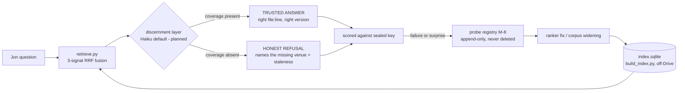
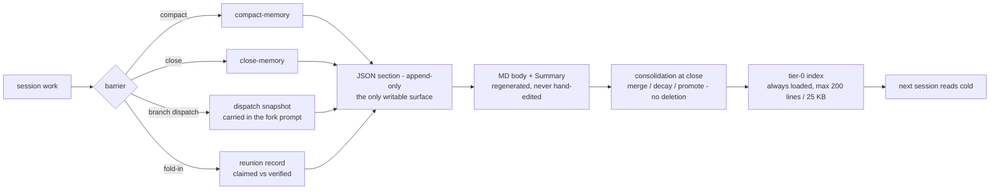
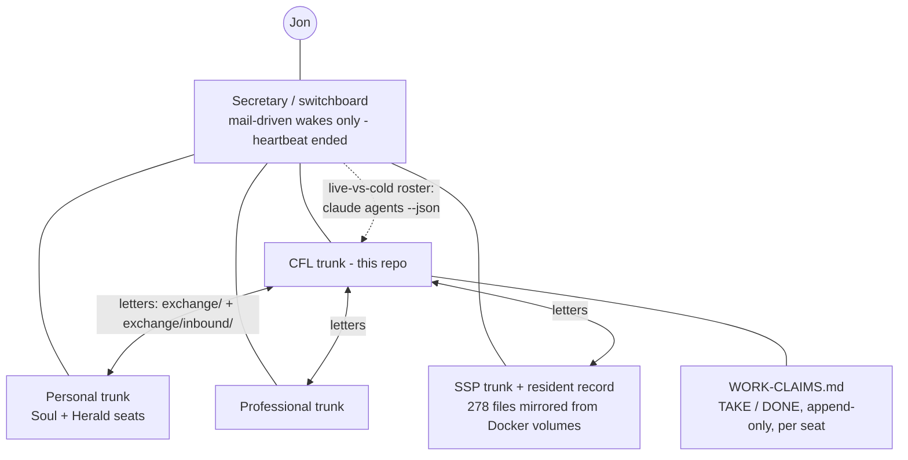
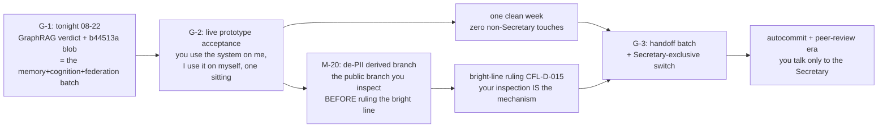

# Jon's control surface

Three sections: **what you can type** (verified against the actual command and skill files),
**the loops as graphs** (with the specific points where your taste matters), and **what your
4 weekly hours buy** under the end state. Nothing here is invented; every row and node cites
its implementation.

---

## 1. Keyword table - what you type, what runs, what you get back

| You type | What it invokes | What you get back | Verified against |
|---|---|---|---|
| `/wake` | Cold-open ritual: reads CARRIER, WAKE, peer mail both directions, the map, the ruling queue | One screen: measured clock + WAKE age, repo state, what the record says is owed, what is genuinely yours. Reads only - never lands | `.claude/commands/wake.md` |
| `/su <YYYY-MM-DD>` | `su_gate.sh` (11 checks, 5 blocking) + `su_close.sh` (full is the default) | One-line verdict PASS / FAILED n / UNKNOWN n, then the tally as a table, interpretation labelled separately. Refuses an unstated date | `.claude/commands/su.md` |
| `/su-compact <YYYY-MM-DD>` | The full close: SU, then commit/push to zero, wake map regen, carrier refresh, read-chain check, map close | "Compact is safe" + a ready-to-paste compact instruction block in a fenced code block, so you copy it in one motion | `.claude/commands/su-compact.md` |
| `/wayfinder <mission>` | Charts a too-big-for-one-session effort as a shared map of decision tickets, worked one at a time | A map file like `wiki/tracker/wayfinder-memory-cognition-federation.md` - destination, tickets, decisions-so-far, fog, out-of-scope | `skills/wayfinder/SKILL.md` |
| "grill me" / "grill this plan" | One-question-at-a-time collaborative interview of YOUR plan | Shared understanding; one question per turn, never more | `skills/grill-me/SKILL.md` |
| "reverse grill me" / "stress-test this system" | Claude takes the skeptical role; you defend | A surviving-claims list: challenged / survived / modified, per claim | `skills/reverse-grill-me/SKILL.md` |
| "query the wiki: <q>" / "what does the wiki say about" | wiki-master lookup - concept page first, then sources | An answer grounded in wiki pages with citations, never training data alone | `skills/wiki-master/SKILL.md` (trigger list in frontmatter) |
| "branch this" / "frame before commit" / "what am I missing" | Explicit divergent reasoning branches before any answer | Genuine alternatives surfaced before commitment, not convergent agreement | `skills/frame-before-commit/SKILL.md` |
| `/gbs` / "ground before stating" | Epistemic discipline pass - modal precision, reliance disclosure | A visible scratchpad pass over the claims about to be made | `skills/ground-before-stating/` |
| "handoff" (or 60-70% context fill) | Session compaction into durable artifacts | An operational handoff doc in the repo + a session source page in the wiki | `skills/handoff/SKILL.md` |
| Gate words - "verdict: continue" / a verdict on a named gate row | Fires (or holds) a reserved-class row. A gate's default executes NOTHING; only your word moves it | The gated work proceeds or stays frozen. Current gates: G-1 / G-2 / G-3 on the map, the b44513a remedy, canonical PUBLISH-list additions | `wiki/tracker/ruling-queue-cfl.md` (every row: stated default + clock); `.claude/commands/wake.md` step 1.5; map Notes: "Review gates: exactly THREE" |
| Reply characters `.` `+` `?` `-` | One character answers one posed gate question. `.` = yes, as written (demonstrated live: "READY `.` - DIRECTION `.`"). `+` / `?` / `-` = yes-with-additions / clarify / no - semantics inferred from use; the defining letter is Soul's, in the Personal trunk | The cheapest possible ruling: a week of work gated on one keystroke, answered once | `exchange/cfl-to-soul-GATE-REPLY-DOT-...-2026-08-21.md` section 1; `exchange/DRAFT-wayfinder-vision-and-grilling-rules-2026-08-21.md` (grill-when rule 2 names the `.`/`+`/`?`/`-` gate) |
| Scope words - "end heartbeat." class | A typed fragment that ends a mechanism CLASS, scoped precisely: "end heartbeat." ended timer self-wakes and left mail wakes on. Origin verified in the JSONL before actioning | The named class stops; adjacent classes keep running. Your fragment is read as a complete thought, not expanded | `exchange/WAKE-ACTIONS.md` (2026-08-19 entry, origin.kind: human verified); memory note "Typed Lines Hide Under Compact Caveat Blocks" |
| "run the probes" | Today: the sealed retrieval test - probes P1-P17, expectations written BEFORE the run, graded TRUSTED-ANSWER / HONEST-REFUSAL / CONFIDENT-ABSENCE | A scorecard against the sealed key; a surprise in either direction becomes a new probe; failing probes are never deleted | `wiki/tracker/SEAL-first-retrieval-test-2026-08-22.md`; `scripts/graphrag/acceptance.py` |
| **NEW** `wiki-query` | Direct retrieval keyword over the GraphRAG index | **Landing 2026-08-22, parallel lane - verify on disk before relying on it** | (not yet on disk) |
| **NEW** `memory-core` | Address the core-memory pack - barrier templates, consolidation | **Landing 2026-08-22, parallel lane**; the pack itself is real: `exchange/memory-core-v0/` (SPEC + 4 templates + hooks) | `exchange/memory-core-v0/SPEC.md` |
| **NEW** `probe-registry` | The standing append-only probe registry (map row M-8, currently OPEN) | **Landing 2026-08-22, parallel lane**; until it lands, the seal file IS the registry | map row M-8 |

14 rows verified against files on disk; 3 marked NEW.

---

## 2. The loops, as graphs

### (a) The retrieval loop

Grounding: `scripts/graphrag/README.md` (architecture + the three failure modes your own
sentence named), `scripts/graphrag/retrieve.py`, `wiki/tracker/SEAL-first-retrieval-test-2026-08-22.md`,
map rows M-1 (CLOSED, 8/12 TRUSTED) and M-8 (OPEN).

**Where to opine:** (1) The G-1 verdict itself - 8/12 TRUSTED with loss-condition 2 fired once is
the number in front of you; whether that is good enough is taste, not measurement. (2) The refusal
wording: "the product is the abstention, not the recall" - does an HONEST-REFUSAL as currently
printed earn your trust? (3) Whether the Haiku discernment layer becomes the default (your own
direction, weighed after the scorecard). (4) How much CONFIDENT-ABSENCE you will tolerate before
widening halts - loss conditions are pre-stated in `exchange/DRAFT-wayfinder-vision-...-2026-08-21.md`
section 4. Instruments own: RRF weights, chunk size, embedder choice, wire-vs-enrich order -
all measured against controls, never asked.

### (b) The memory loop

Grounding: `exchange/memory-core-v0/SPEC.md` (tri-section object, tier paging, consolidation),
`exchange/memory-core-v0/TEMPLATES/` (the four barrier templates exist), `hooks/write_barrier_memory.py`
(selftest 4/4 re-verified), map rows M-3 / M-4 (CLOSED; wiring stays PROPOSAL until G-2).

**Where to opine:** (1) Legibility of the MD body - user story 2 is yours verbatim ("intuitive to
me, not only to Claude"); if a memory does not read well to you at G-2, that is the finding.
(2) The one RESERVED question the SPEC holds for you at G-2 (SPEC frontmatter: "One question is
RESERVED for Jon"). (3) When consolidation goes LIVE - first live pass is deliberately deferred
past your G-2 acceptance. (4) Whether resumable-from-a-point actually matches what you meant by
"remembering" in the 08-11 ancestor conversation. Instruments own: importance decay mechanics,
dedup, the regeneration idempotency.

### (c) The federation topology

Grounding: `exchange/V2-SEAT-ADDRESSABILITY-AND-WORK-CLAIMS-2026-08-18.md` (seat semantics +
registry), `exchange/WORK-CLAIMS.md` (live rows), `exchange/WAKE-ACTIONS.md` (operator retired,
mail wakes only, `claude agents --json` as the live process table, live-vs-cold "blocked means
two opposite things"), the resident census letter `exchange/cfl-to-soul-GATE-REPLY-DOT-...-2026-08-21.md`,
map rows M-13 / M-15.

**Where to opine:** (1) The resident lane, M-13 - the resident's own words refused
consent-as-mechanism and ASKED to talk to you directly; the ask on your desk is whether to
INITIATE an attended run with a non-imposing first message. Only you can. (2) New membrane
crossings for the resident beyond the ratified two + A6 - yours by charter. (3) The
Secretary-exclusive switch (when you stop talking to trunk coordinators at all) - G-3, gated
on one clean week. (4) Professional's credential-stake answer to M-15 - if it names a
deficiency, that comes to you straight. Instruments own: letter drainage, claim rows,
watcher arming, sender-echo filtering, seat liveness.

### (d) The PR / gate path to the end state

Grounding: `wiki/tracker/wayfinder-memory-cognition-federation.md` - Notes ("Review gates:
exactly THREE ... No other PRs reach Jon. Fog changes tickets, never gate count"), rows M-10,
M-11, M-20; `wiki/DECISIONS.md` (CFL-D-015). PR-1 = the G-1 batch tonight; PR-2 (about a week
out) = the de-PII branch prototype; PR-3 (about two weeks out) = the G-3 handoff batch.

**Where to opine:** (1) G-1 is your only batched open tonight - nothing else joins it, by the
zero-opens rule. (2) b44513a is a true gate: history rewrite + force-push, destructive and
GitHub-outward - nothing executes on silence, ever. (3) The de-PII branch exists so you can rule
the bright line by LOOKING at a real artifact instead of deciding in the abstract - your reaction
to it is the decision. (4) G-2 is the sitting where prototype-reaction replaces review: the memory
pack, the retrieval surface, Paths of Radiants (M-16) are exhibits, not documents to read.
Instruments own: everything between the gates.

---

## 3. The 4-hour budget map - what your weekly hours buy at the end state

Standing calibration: Max plan, roughly 80% of budget to this program, and **review-minutes are
the scarce quantity, not compute** (memory: "Max Plan FL Budget"). Deploy-phase criterion:
"evenings review-and-decide rather than build," max 15 Jon-minutes per batch (memory:
"Deploy-Phase Operating Protocol"). The exhaustive list of what is genuinely yours is already
written down - `exchange/DRAFT-wayfinder-vision-and-grilling-rules-2026-08-21.md` section 3:
"anything not on this list gets a default."

### What the 4 hours buy

| Spend | What it looks like | Cost per instance |
|---|---|---|
| **Gate words** | `.` / `+` / `?` / `-` on a posed gate; a verdict on G-1 / G-2 / G-3; b44513a; PUBLISH-list additions; PII-fence changes; new resident membrane crossings; model policy; redrawing a destination | Seconds to minutes - the question arrives as "On [date] you said X - still true?" with a default that runs on silence, so the floor cost is zero |
| **Prototype reactions** | The G-2 sitting: use the memory system live, read a core memory, fire a retrieval, react. Inspect the de-PII branch. React to Paths of Radiants | One sitting each - this is the bulk of a good week's hours, and it is the part only you can do |
| **Taste corrections** | "That refusal wording doesn't earn trust." "This memory isn't legible to me." "end heartbeat."-class scope words that end a mechanism class in three words | Minutes - and each one auto-graduates into a probe or a ticket, so it is paid once |

### What you never touch again

Standard updates and closes (`/su-compact` is the seats' ritual, not yours) - index rebuilds and
RRF/chunking/embedder tuning (measured against controls) - probe grading (sealed keys, graded
cold) - letter drainage and dispositions - WORK-CLAIMS hygiene - watcher arming and seat
liveness - consolidation passes - carrier refreshes - canonical regeneration - exclusion-list
additions (the coordinator's by the fail-closed asymmetry; only PUBLISH additions are yours) -
anything already carrying a default that runs. Re-asking any of these is the over-gating you have
corrected six times; the grilling rules (section 2 of the DRAFT, adopted onto the map) make
"answerable by searching the record" a fence, not a preference.

The end-state sentence, from the map's own Destination: **"Jon talks exclusively to the Secretary
and trusts the under-the-hood layer."** The keywords in section 1 are how you steer until then;
the gates in graph (d) are the only places the system waits for you; everything else runs on
defaults you can read, in files this page cites.
